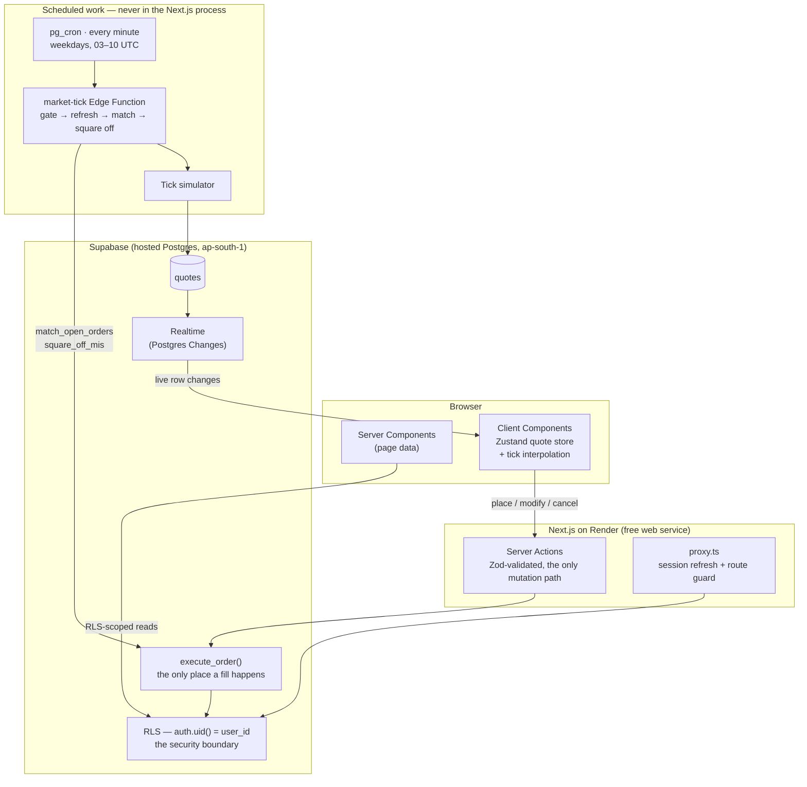

# ZerodhaRebuild

**Learn how Indian stock trading actually works, without risking a rupee.**

A paper-trading platform modelled on Zerodha's Kite terminal. Sign in with Google, get ₹1,00,000 of
simulated cash, and trade around 200 real NSE stocks — with the margin blocking, order rejections,
brokerage and taxes that a real broker would apply.

**→ [Try it live](https://zerodha-rebuild.onrender.com)** · No signup form, no card, no real money
anywhere in the system.

---

## Screenshots

| | |
| --- | --- |
| **Stock detail** — candlesticks, OHLC, and a buy/sell ticket  | **Order ticket** — position-aware margin, before you commit  |
| **Funds** — every rupee that moved, as a ledger  | **Pricing** — the charge model the engine actually applies  |

---

## Features

**Trading**

- **Market and limit orders**, in **CNC** (delivery) and **MIS** (intraday) — the same product split
  Zerodha uses.
- **Limit orders rest and fill on their own** when the price crosses them. You don't have to be
  watching.
- **Short selling on MIS**, with collateral held against the position until you cover.
- **Intraday positions close themselves at 15:20 IST**, the way a real broker force-squares them.
- **Orders can be modified or cancelled** while they're still open, and the margin follows.

**The money is modelled properly**

- **Every charge a real trade incurs**: brokerage, STT, exchange transaction charges, the SEBI
  turnover fee, stamp duty, GST, and DP charges on delivery sells.
- **Margin is blocked when you place an order** and released when it fills, cancels, or is rejected.
- **A complete ledger** — every rupee that moves is one row, and the rows always add up to your
  balance.
- **Realised and unrealised P&L**, with the day's change measured against the previous close.

**Everything around it**

- A **watchlist** you can search, reorder, and trade straight from, with prices that tick and flash.
- **Holdings, Positions, Funds, Reports**, and a **stock detail page with candlestick charts**.
- **Reset your account** to a clean ₹1,00,000 whenever you want.
- **Light and dark themes**, works down to a 375px phone, and accessibility-audited.

---

## How it works

In plain terms, five things happen.

**1. You sign in, and an account appears.** Google OAuth, no forms. A database trigger creates your
profile with a generated client ID, credits ₹1,00,000, writes the matching ledger row, and seeds a
starter watchlist — so you never land on an empty screen.

**2. Prices move on their own.** A job runs inside the database every minute the NSE is open. It
takes each stock's real closing price and walks it forward, then pushes the new price to your browser
over a realtime connection. Between updates the browser smoothly interpolates, so the number ticks
instead of jumping once a minute.

That job lives in the database rather than the website on purpose: the site sleeps when nobody visits
it, and the market shouldn't stop just because nobody's watching.

**3. You place an order.** The app checks you can afford it and blocks that money as margin. A market
order fills right away at the current price. A limit order waits, and the same background job fills
it the moment the price crosses.

**4. The fill happens in one shot.** Cash is debited, charges calculated and applied, a trade
recorded, a holding or position created or updated, and ledger rows written — all inside a single
database transaction. It either all happens or none of it does. There's no state where your money
left but your shares never arrived.

**5. Intraday clears itself out.** At 15:20 IST every open MIS position is closed at the current
price, with the realised P&L recorded, exactly as a broker would.

---

## Tech stack

| | |
| --- | --- |
| **Frontend** | Next.js (App Router, Server Components by default) · React · TypeScript in `strict` · Tailwind CSS · shadcn/ui on Radix |
| **Client state** | Zustand for the in-memory quote store and tick interpolation · Recharts for the portfolio donut · Lightweight Charts for candlesticks |
| **Data** | Supabase Postgres · Row Level Security · plpgsql functions for everything involving money |
| **Auth** | Supabase Auth, Google OAuth only |
| **Realtime & jobs** | Supabase Realtime · Edge Functions on Deno · `pg_cron` for scheduling |
| **Testing** | Vitest · pgTAP · node-postgres for concurrency races |
| **Hosting** | Render (free web service) + hosted Supabase |

Exact pinned versions live in `package.json`, and `/about` renders them from a typed list with a
drift test against it — so they're never repeated anywhere they could quietly go stale.

---

## Prices are simulated, and the app says so

This is the part most worth understanding.

**No external market-data provider is wired.** Twelve Data's free plan carries no NSE symbols at all
(verified with a real key), and a validation probe against Yahoo got the development machine's IP
blocked. No keyless source proved workable, so the built-in tick engine isn't a fallback — it's the
whole quote chain, by decision.

What that means concretely:

- The **instruments are real** — Nifty 200 constituents, each walking from a real NSE closing price.
- The **prices are simulated**, and every price on screen can tell you so.
- Every quote stores its provider and timestamp, and the badge is **derived when you read it**, never
  stored. In this build every quote resolves `SIMULATED`.
- Two of the four provenance states are unreachable here and the UI admits it: `DELAYED`, because no
  real provider exists, and `LIVE` structurally — that one is reserved for a provider that genuinely
  streams, and a polled REST endpoint may never claim it.

The machinery stays in the code even though only one branch can fire, because the interesting
property is that the badge *refuses to overclaim*. A `LIVE` chip over a polled endpoint would be
exactly the dishonesty it exists to prevent.

---

## Architecture

### What's worth reading in the code

- **No money is computed in TypeScript.** Every balance, average price, charge total and realised P&L
  is `numeric` arithmetic in Postgres, read back for display. TypeScript formats numbers; it never
  produces a stored one.
- **Order fills happen in exactly one function.** `execute_order` takes `SELECT … FOR UPDATE` on the
  user's funds row before reading the balance, re-checks the order is still open under that lock, and
  is the only writer of a fill — not a Server Action, not a route handler, not the Edge Function.
- **One lock order everywhere:** `orders` → `funds` → `holdings`/`positions`. A pgTAP suite reads the
  sequence back out of each live function definition and pins it, because adding a guard under a row
  lock is also a change to lock order.
- **RLS is the security boundary, not application code.** On the six money tables, `select` is the
  only grant any client role holds. There is no write policy for any command, so every write arrives
  through a `security definer` function.
- **Shorts carry two averages that may never cross.** One is net of charges and exists only for P&L;
  the other is gross and exists only as the collateral basis. Using either for the other's job
  silently under-collateralises the position or reports charges as profit.

### How it's tested

Four tiers, each doing something the others cannot.

What each tier covers

 

1. **Logic** (Vitest, no database) — charge estimator, provider chain, market-hours, parsers.
2. **Database** (pgTAP) — RLS, grants, CHECK constraints, function correctness. Run through a custom
   runner rather than `supabase test db`, which demands Docker even against a remote database.
3. **Concurrency** (two live Postgres connections) — row-lock races the other tiers cannot express.
   Gated behind an environment variable because it commits real rows.
4. **Parity** (read-only) — the TypeScript charge estimator and the Postgres calculator must agree
   *exactly*, over random inputs. Money is computed in Postgres, but the order ticket shows an
   estimate before you commit; this is what stops the two drifting.

---

## Running it locally

Clone, `pnpm install`, point it at a Supabase project, and run `pnpm dev`.

**→ [`docs/SETUP.md`](docs/SETUP.md)** has the full walkthrough: prerequisites, environment
variables, every command, and the deployment notes.

---

## Scope

**In:** the marketing site; Google OAuth with automatic account bootstrap; ~200 NSE symbols; a live
watchlist; market and limit orders in CNC and MIS; the full charge model; margin reservation
including short collateral; limit-order matching and 15:20 IST square-off; Holdings, Positions, Funds
with a complete ledger, Reports, and stock detail with candlesticks; account reset; light and dark
themes; RLS on every user-owned table.

**Out, deliberately:** any real-money movement; real brokerage integration; derivatives; SL/GTT/AMO,
bracket and cover orders; mutual funds, IPOs and bonds; KYC; order-book depth simulation; multi-user
interaction; notifications; native apps; corporate actions; CNC short selling; backtesting.

<strong>Known simplifications</strong> — disclosed here and on <code>/legal</code> in the app

 

- **DP charge is per sell order**, where a real broker charges per scrip per day. Matching reality
  would mean querying same-day trades inside the locked transaction.
- **Fills are all-or-nothing.** There's no simulated counterparty book, so partial fills don't exist.
- **A short's loss is capped at its collateral.** When covering would drive cash below zero the
  position still closes, the debit is capped, and the remainder is recorded as an auditable
  adjustment. A real broker would issue a margin call instead.
- **Day's P&L measures everything against the previous close**, including shares bought today, where
  a broker splits those out.

---

## Author

Built by **Siddarth Vaidya**.

---

## License

MIT — see [LICENSE](LICENSE).

This is an unaffiliated portfolio project, not associated with or endorsed by Zerodha Broking Ltd.
