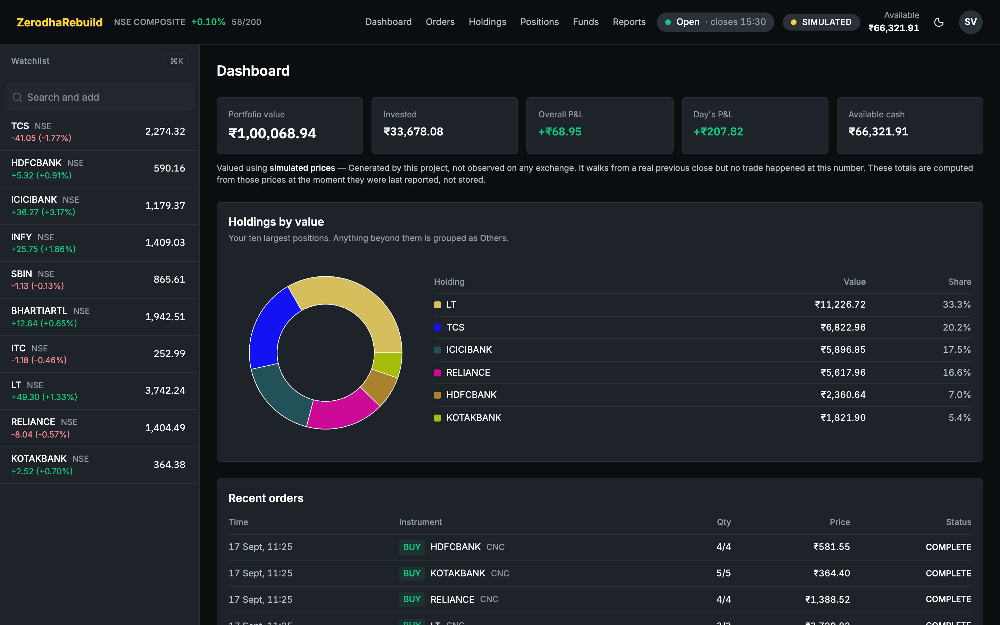
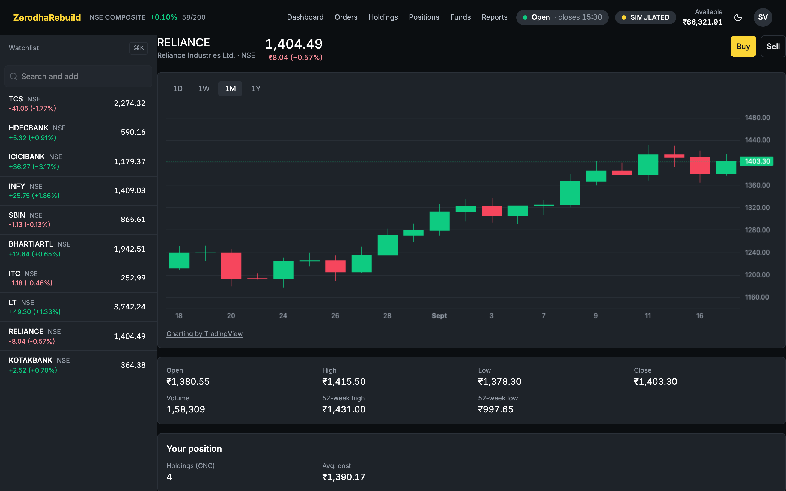
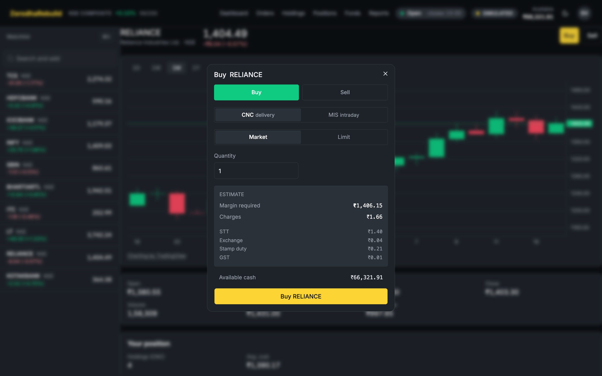
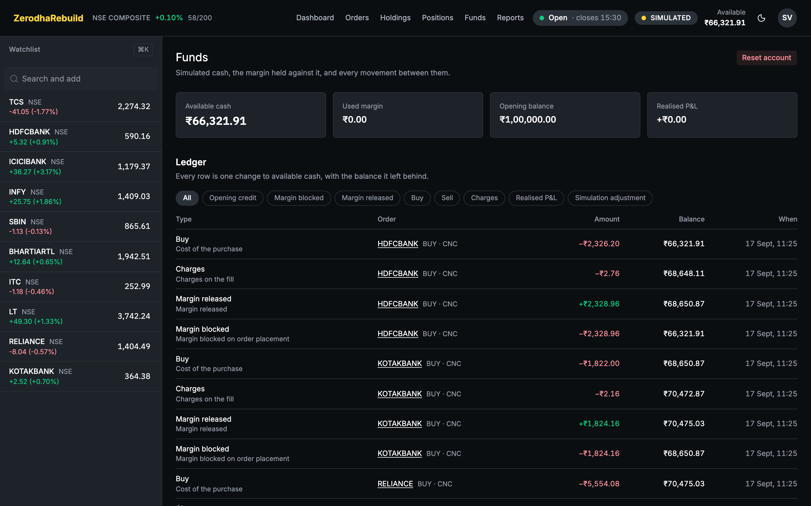
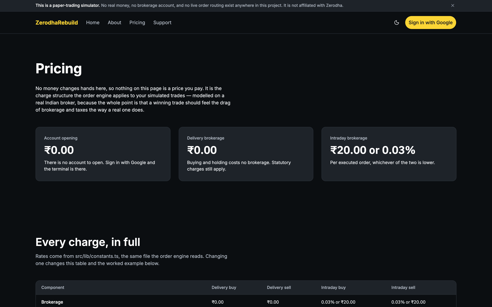
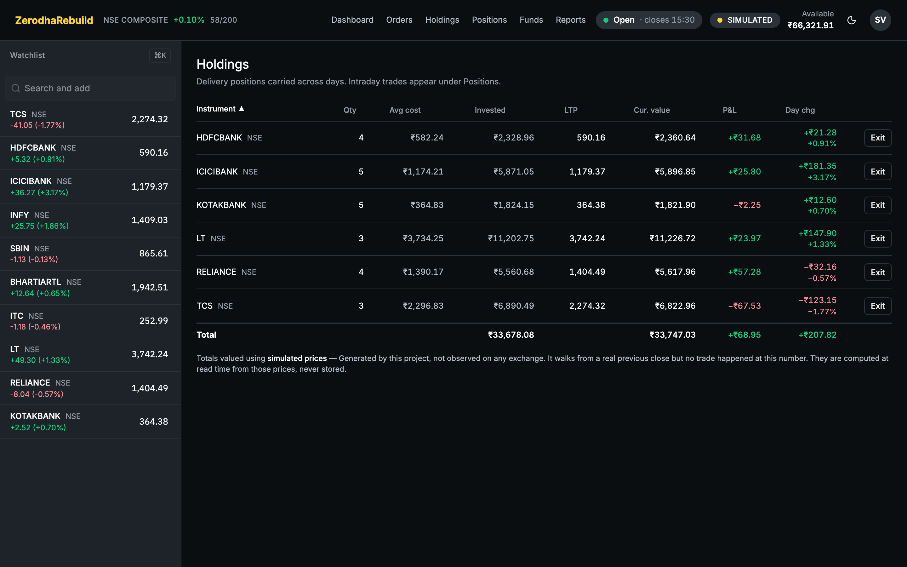
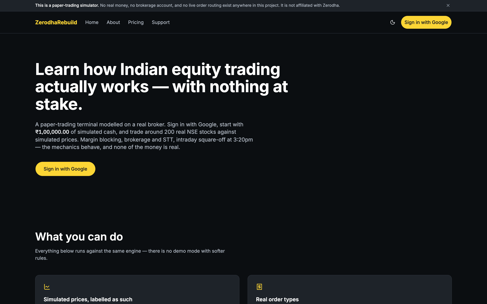
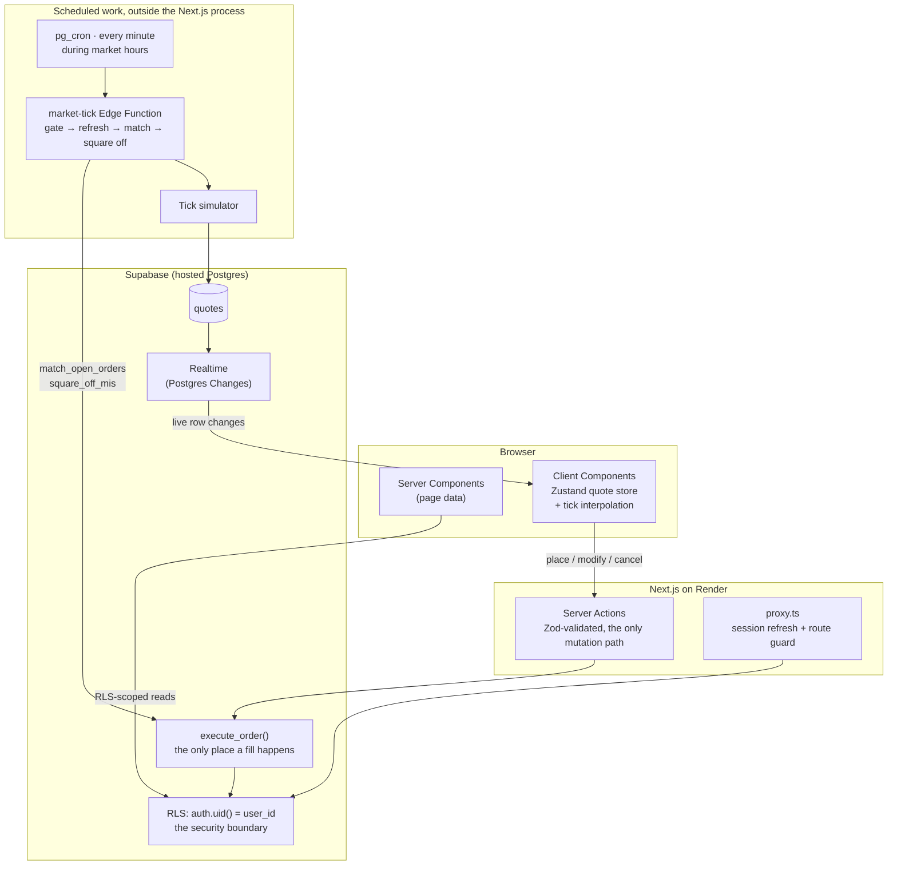

<div align="center">

# ZerodhaRebuild

**Paper-trade NSE stocks on a broker-grade engine. ₹0 at risk.**

A full-stack paper-trading platform modelled on Zerodha's Kite terminal, with real margin,
charges, order matching and an auditable ledger.

[](https://nextjs.org)
[](https://www.typescriptlang.org)
[](https://supabase.com)
[](#testing)
[](context/architecture.md#quote-provenance)
[](LICENSE)

**[Live demo](https://zerodha-rebuild.onrender.com)** ·
**[Portfolio](https://siddarthvaidya2005-7iyf.onrender.com/)** ·
**[LinkedIn](https://www.linkedin.com/in/siddarth-vaidya-885871239)**



</div>

> [!NOTE]
> An independent portfolio project, **not affiliated with or endorsed by Zerodha Broking Ltd.**
> No real money moves anywhere in the system, and all prices are simulated.

## Contents

[Highlights](#highlights) · [Screenshots](#screenshots) · [Features](#features) ·
[Tech stack](#tech-stack) · [How it works](#how-it-works) · [Architecture](#architecture) ·
[Testing](#testing) · [Challenges and lessons](#challenges-and-lessons) ·
[Getting started](#getting-started) · [Scope and limitations](#scope-and-limitations) ·
[Roadmap](#roadmap) · [Author](#author)

---

## Highlights

- **Atomic order execution.** Every fill runs in a single Postgres transaction inside one function,
  `execute_order`, so money can never leave an account without the shares arriving.
- **All money math in the database.** Balances, average prices, charges and P&L are `numeric`
  arithmetic in Postgres. TypeScript only formats them.
- **Row Level Security as the security boundary.** Client roles can only `select` the money tables;
  every write goes through a `security definer` function.
- **Concurrency-safe by design.** One global lock order, pinned by a test that reads it back out of
  the live function definitions.
- **Four test tiers**, including real two-connection race tests and a parity check that keeps the
  TypeScript charge estimate and the Postgres calculator exactly equal.
- **Honest data provenance.** Every price carries its source, and the UI never labels simulated data
  as live.

---

## Screenshots

| | |
| --- | --- |
| **Stock detail**: candlesticks, OHLC and a buy/sell ticket<br> | **Order ticket**: position-aware margin, shown before you commit<br> |
| **Funds**: every rupee that moved, as a ledger<br> | **Pricing**: the charge model the engine applies<br> |
| **Holdings**: live P&L and day change on delivery positions<br> | **Landing page**: the public marketing site<br> |

---

## Features

| Area | What you get |
| --- | --- |
| **Orders** | Market and limit orders, in CNC (delivery) and MIS (intraday). Limit orders rest and fill automatically. Open orders can be modified or cancelled. |
| **Risk** | Margin is blocked on placement and released on fill, cancel or rejection. MIS short selling with collateral. Intraday positions are squared off at 15:20 IST. |
| **Charges** | Brokerage, STT, exchange transaction charges, SEBI fee, stamp duty, GST and DP charges, as a real trade incurs them. |
| **Portfolio** | Holdings, Positions, Funds with a complete ledger, Reports, and realised and unrealised P&L. |
| **Terminal** | A searchable, reorderable watchlist with ticking prices, stock detail pages with candlestick charts, and one-click account reset to ₹1,00,000. |
| **Quality** | Light and dark themes, responsive down to a 375px phone, and accessibility-audited with Lighthouse. |

Full scope: [`context/project-overview.md`](context/project-overview.md).

---

## Tech stack

| Layer | Technology |
| --- | --- |
| **Frontend** | Next.js 16 (App Router, Server Components) · React 19 · TypeScript (strict) · Tailwind CSS v4 · shadcn/ui on Radix |
| **Client state and charts** | Zustand · Lightweight Charts · Recharts |
| **Backend and data** | Supabase Postgres · plpgsql functions · Row Level Security · Zod-validated Server Actions |
| **Auth** | Supabase Auth with Google OAuth |
| **Realtime and jobs** | Supabase Realtime · Edge Functions (Deno) · `pg_cron` |
| **Testing** | Vitest · pgTAP · node-postgres |
| **Hosting** | Render · hosted Supabase |

Pinned versions live in [`package.json`](package.json). Full stack rationale:
[`context/architecture.md`](context/architecture.md#stack).

---

## How it works

1. **Sign in with Google.** A database trigger creates your profile, credits ₹1,00,000, writes the
   matching ledger row and seeds a starter watchlist.
2. **Prices move.** A `pg_cron` job calls an Edge Function every minute during NSE hours. It walks
   each stock forward from its real closing price and streams updates to the browser over Realtime,
   where they are interpolated so prices tick smoothly.
3. **Place an order.** A Server Action validates it and blocks margin. Market orders fill
   immediately; limit orders fill when the price crosses.
4. **The fill is one transaction.** Cash, charges, the trade, the holding or position, and the ledger
   rows all commit together or not at all.
5. **Intraday clears itself.** At 15:20 IST every open MIS position is closed and its P&L recorded.

> [!IMPORTANT]
> **Prices are simulated.** The ~200 instruments are real Nifty 200 constituents, but their prices
> are generated from real NSE closing prices, because no free data source offered usable NSE
> quotes. Each quote stores its provider and timestamp, and its badge is derived at render time, so
> the app can never claim to be live. Details:
> [`context/architecture.md` → Quote Provenance](context/architecture.md#quote-provenance).

---

## Architecture



**Why scheduled work lives in the database:** Render's free tier sleeps after 15 minutes idle, and the
market should keep moving when nobody is visiting.

| Go deeper | Document |
| --- | --- |
| System boundaries, auth and the invariants | [`context/architecture.md`](context/architecture.md#invariants) |
| Tables, views and folder structure | [`context/architecture/data-model.md`](context/architecture/data-model.md) |
| Charges, margin, ledger and P&L rules | [`context/trading-contract.md`](context/trading-contract.md) |
| Server Action and Postgres function patterns | [`context/architecture/patterns.md`](context/architecture/patterns.md) |
| Code standards | [`context/code-standards.md`](context/code-standards.md) |

---

## Testing

| Tier | Tool | What it proves | Command |
| --- | --- | --- | --- |
| **1. Logic** | Vitest | Charge estimator, market hours, parsers, provider chain | `pnpm test` |
| **2. Database** | pgTAP | RLS, grants, CHECK constraints, function correctness, lock order | `pnpm test:db` |
| **3. Concurrency** | node-postgres | Row-lock races across two live connections | `pnpm test:race` |
| **4. Parity** | node-postgres | The TypeScript charge estimate equals the Postgres calculation exactly | `pnpm test:parity` |

Details: [`context/code-standards/testing.md`](context/code-standards/testing.md).

---

## Challenges and lessons

- **No free NSE data.** Twelve Data's free plan carries no NSE symbols, and probing Yahoo got the
  development IP blocked. Rather than ship a fragile scraper, I made the simulator the entire quote
  chain and built provenance so the UI stays honest about it.
- **Race conditions in money code.** Fills, cancels, limit matching and square-off all contend for the
  same rows. The answer was a single lock order (`orders` → `funds` → `holdings`/`positions`) enforced in every function,
  plus a test that fails if any function drifts from it.
- **Testing a remote database without Docker.** `supabase test db` needs Docker even against a hosted
  database, so I wrote a small runner that executes the pgTAP suites directly.
- **A blank page that was really HTTP 431.** Leftover auth cookies from other local projects pushed
  request headers past Node's 16 KB limit, so requests died before reaching Next.js, with no log line.

Design notes and past decisions: [`context/constraints.md`](context/constraints.md).

---

## Getting started

**Prerequisites:** Node 26, pnpm 11 and a Supabase project. Docker is not needed.

```bash
git clone https://github.com/SidVaidya2005/ZerodhaRebuild.git
cd ZerodhaRebuild
pnpm install
cp .env.example .env.local   # fill in your Supabase values
pnpm supabase link --project-ref <your-project-ref>
pnpm supabase db push
pnpm seed
pnpm dev                     # http://localhost:3000
```

Google OAuth, environment variables, the scheduled job, every command and deployment are covered in
**[`docs/SETUP.md`](docs/SETUP.md)**.

---

## Scope and limitations

**Deliberately out of scope:** real money or brokerage integration, derivatives, SL/GTT/AMO and
bracket orders, mutual funds and IPOs, KYC, and CNC short selling. The full list is in
[`context/project-overview.md`](context/project-overview.md#features-out-of-scope).

**Known simplifications** (also disclosed on `/legal` in the app):

- DP charges apply per sell order rather than per scrip per day.
- Fills are all-or-nothing; there are no partial fills.
- A short's loss is capped at its collateral instead of triggering a margin call.
- Day's P&L measures every holding against the previous close, including shares bought today.

The rules behind each one are in [`context/trading-contract.md`](context/trading-contract.md).

---

## Roadmap

- [ ] Plug in a real delayed NSE data provider; the provenance model already supports it
- [ ] Stop-loss and GTT orders
- [ ] Partial fills against a simulated order book
- [ ] DP charges per scrip per day, matching real brokers
- [ ] Corporate actions such as splits and dividends

---

## Author

Built by **Siddarth Vaidya**.

[](https://siddarthvaidya2005-7iyf.onrender.com/)
[](https://www.linkedin.com/in/siddarth-vaidya-885871239)
[](https://github.com/SidVaidya2005)
[](mailto:siddarthvaidya2005@gmail.com)

## License

[MIT](LICENSE)
